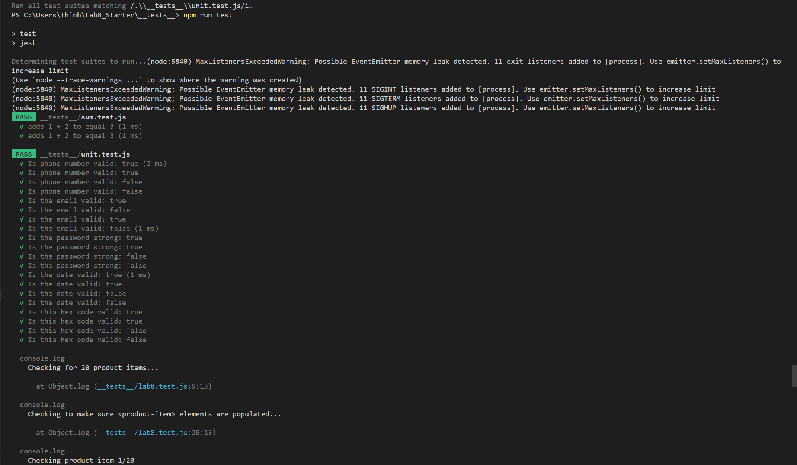
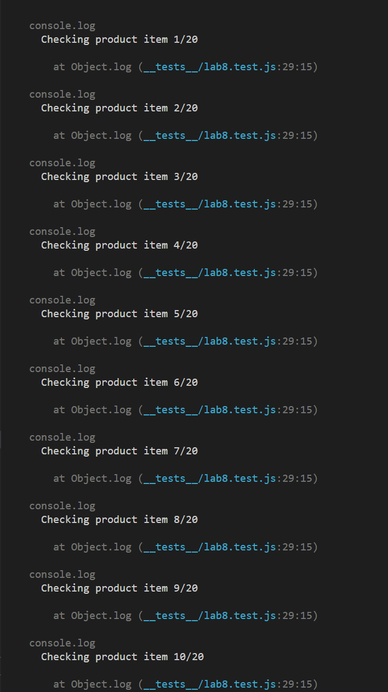
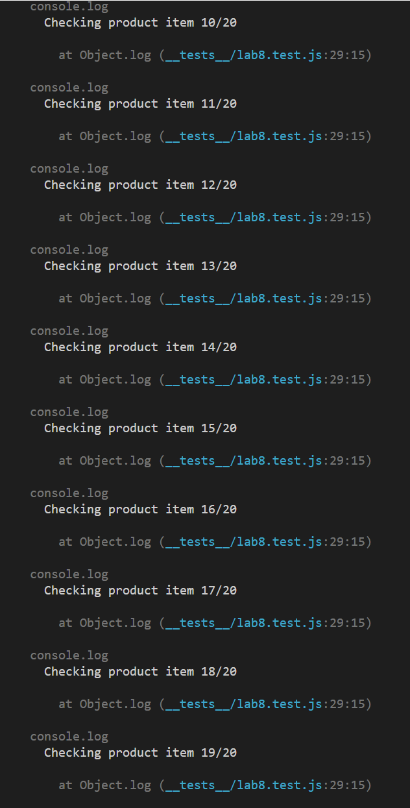
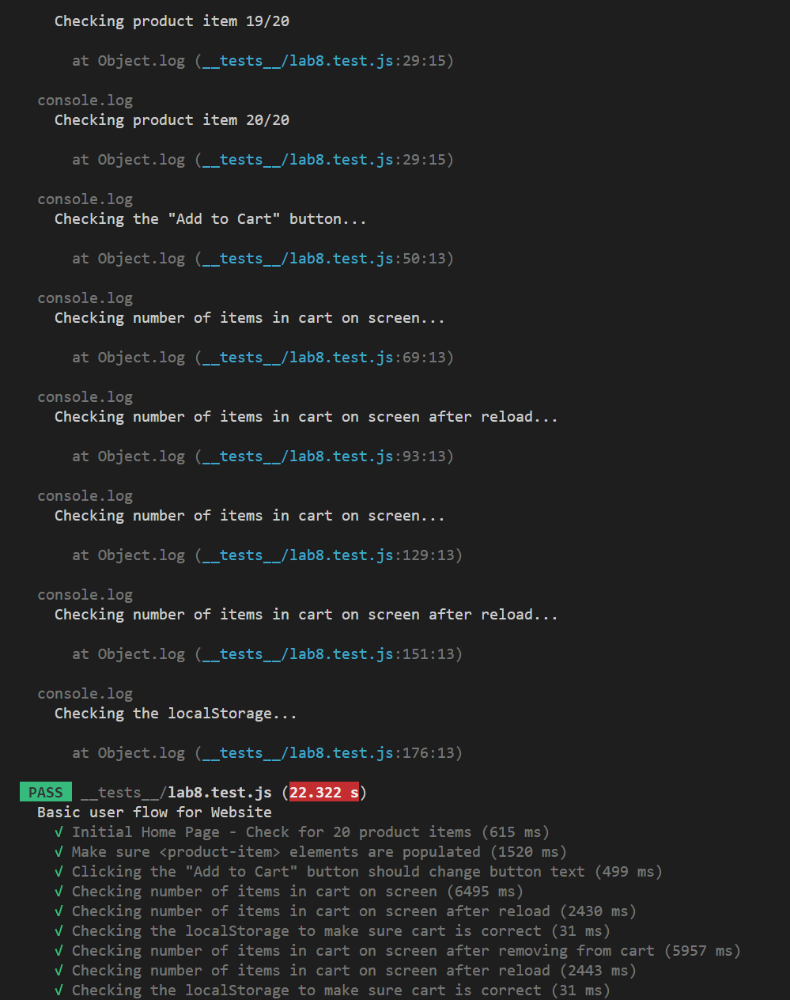
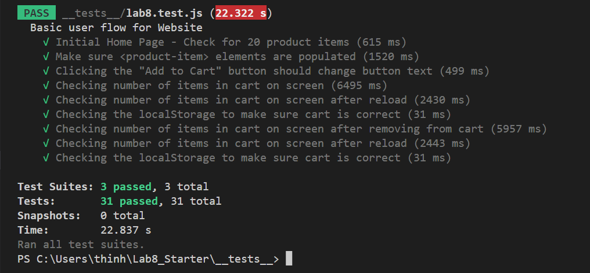

# Lab 8 - Starter

### 1) Where would you fit your automated tests in your Recipe project development pipeline? Select one of the following and explain why.
1. Within a Github action that runs whenever code is pushed
2. Manually run them locally before pushing code
3. Run them all after all development is completed

    I would say that my automated tests should fit within a Github action that runs whenever code is pushed. The reason I chose this option is because it makes sure all the committed codes are checked before it's deployed and merge to the main branch.

### 2) Would you use an end to end test to check if a function is returning the correct output? (yes/no)

    Yes

### 3) Would you use a unit test to test the “message” feature of a messaging application? Why or why not? For this question, assume the “message” feature allows a user to write and send a message to another user.

    Yes, I would use a unit test to test the "message" feature of a messaging application because we need to check if the feature is doing its job which is taking the input string from user and outputting it. Also, we need to check if the message is displayed correctly.

### 4) Would you use a unit test to test the “max message length” feature of a messaging application? Why or why not? For this question, assume the “max message length” feature prevents the user from typing more than 80 characters.

    Yes, I would use a unit test to test the "max message length" feature of the messaging application because it makes sure that the feature is working correctly preventing the users from writing too long of a message.

### Screenshots of the test result

